# Rails Assignment | Two-sided Marketplace

**Table of contents**
    * [Overview](#Overview)
        * [Setup](#Setup)
        * [Platforms](#Platforms)
        * [Gem notes](#Gem-notes)
    * [Problem and Solution](#Problem-and-solution)
        * [Problem](#Problem)
            * [Problem 1](#Problem-1)
            * [Problem 2](#Problem-2)
        * [Solution](#Solution)
    * [User stories](#User-stories)
    * [Workflow diagram](#Workflow-diagram)
    * [Wireframes](#Wireframes)
    * [Updated wireframes](#UPDATED-wireframes)
    * [ERD](#ERD)
    * [For the future](#For-the-future)
    * [Notes](#Notes)

## Overview
Exelim is a two-sided marketplace to buy and sell second hand PC parts.
* Website: <a href="https://exelim.herokuapp.com/">Exelim</a>
* Github: <a href="https://github.com/jp0123">Joseph's Github</a>

### Setup
Please keep the following in mind while setting up
* This app requires Ruby on Rails.
* Setup Heroku for production
* Setup Postgresql for development and production
* Setup your unique ENV variables

### Platforms
Please set up accounts with
* AWS
* Heroku
* Sendgrid

### Gem notes
* Remember to "bundle install" after cloning app.
* Major gems
    * AWS (s3)
    * Bootstrap
    * Carrierwave
    * Devise
    * Figaro
    * Sendgrid

## Problem and Solution
### Problem
Exelim is built to solve two problems. 
#### Problem 1
The act of buying and selling second hand PC parts is a difficult process. Current solutions are ineffective and inefficient. A dedicated and robust platform is required.

Problems when buying second hand PC parts:
1. Quality Assurance - buying good or at least of acceptable quality parts.
2. Access - No central, dedicated, and trusted platform.
3. Trust - Difficulty establishing trust between parties. Buyer and seller both having each others best interests in mind too. 
4. Accountability - Should a dispute or error within a transaction occur, it is difficult to ensure a fair outcome.

There are good quality second hand parts available but, due to the above issues it is difficult in both selling and buying them. 

#### Problem 2
E-waste is becoming a growing problem. 

Here is an <a href="https://news.un.org/en/story/2017/12/639312-electronic-waste-poses-growing-risk-environment-human-health-un-report-warns">article</a> by the United Nations that reports the problem.

By encouraging and enabling transactions for second hand pc parts, this can help reduce the problem.

### Solution

A two-sided marketplace for second hand PC parts. 
1. Quality Assurance
    * Ratings and review system for each seller and buyer
    * Verification of users (e.g. verification icon)
2. Access
    * A twosided marketplace that will enable users to effectively and efficiently buy/sell PC parts 
3. Trust
    * Quality assurance
    * Verified users
4. Accountability
    * Quality assurance
    * Verified users
    * Safeguarded processes (e.g. a transaction is only fully processed if both parties meet conditions.)

## User stories

### Preliminary User Stories
A snapshot of some of the preliminary user stories for the users of the platform:
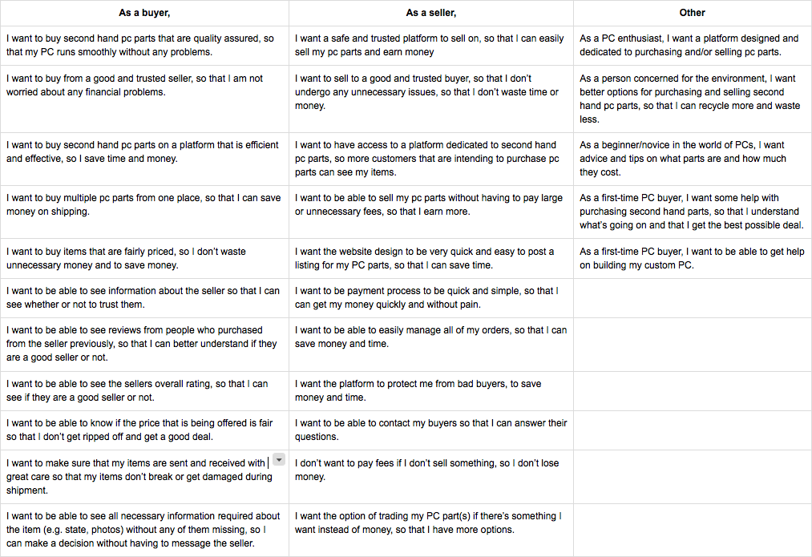

### Detailed User Story 1
Vistors should be able to browse categories and view item details without having to sign up.

Feature: View
* As a visitor
* I want to be able to browse and navigate the website and view item details
* Because I want to have the freedom to see before deciding to commit

Scenario: A person discovers the website
* Given the fact that the person is a visitor (i.e. not a user), the visitor can view all of the categories available
* The visitor is interested in the graphics card section so they click it
* Inside the graphics card section, they are interested in the GTX 1080 so they click it
* The visitor is able to view all the available information on the item (i.e. enough for the visitor to want to make an informed decision)
* The visitor will make a decision to sign up for an account to buy or sell, otherwise will leave

### Detailed User Story 2
Visitors should only be able to buy and/or sell a product if they have registered for an account.

Feature: Create an account
* As a visitor
* I want to create and register for an account
* Because I want to purchase items

Scenario: Visitor becomes a User
* A visitor enters the website.
* The visitor is browsing through the website and decides to buy and/or sell an item.
* The visitor clicks on the "sign up” option on the navigation bar.
* The visitor is now on the sign up page.
* The visitor inputs their details
    * name
    * email
    * mobile phone number
    * address
* The visitor completes and submits the form
* The visitor has now become a user with the ability to buy and/or sell items

### Detailed User Story 3
A user (i.e. a person with a registered account) should be able to buy a listed item.

Feature: Buy

Scenario: The user finds an item that they are interested in and wish to purchase it.
* Assumption: user is logged in.
* The user is in the product page
* The user clicks add to cart
* The item will be saved to their cart
* The page will redirect them to the checkout page
* On the checkout page it lists the item they have added to their cart and the amount due.
    * The user will then click “checkout” button
* The user will then land on the “customer information” page
    * If the user has already signed up their details will be auto-populated, otherwise they will have to fill out their details:
        * email address
        * shipping address
* After completing the customer information page, the user will then have to select their shipping options
* After completing the shipping section, they will have to input their financial details.
    * Stripe
    * Billing address
    * After all information is input, they will press the “complete order” button
* At this point the user would have bought the item and it redirects them to a “successful transaction” page. 

### Detailed User Story 4
A user (i.e. a person with a registered account) should be able to sell a listed item.

Feature: Sell

Scenario: The user wants to sell an item.
* Assumption: the user is logged in and is on the home page.
* The user clicks on the “sell” button on the navigation bar
* It will redirect the user to the “product listing page”
* On the “product listing page” the user needs to populate information about the product:
    * Title
    * Category (drop down menu to select)
    * Image (multiple images of the item)
    * Description (additional helpful information)
    * Shipping method
    * Payment method
* After all fields have been successfully completed, the item can be listed by clicking the “list product” button
* After the button has been clicked it will redirect the user to the seller’s dashboard (which lists all the items that are being sold).

### Detailed User Story 5
A user should be able to message another user. 

Feature: Message

Scenario: A buyer messages a seller and the seller responds to the buyer. 
*  Assumption: the buyer is logged in and is on the product page.
* The buyer clicks the “message me” button in the product description box
* This will redirect the buyer to a ‘contact page’ with a form that they can fill out and send to the seller.
* The message will send to seller via email. The seller will reply via email. 

## Workflow diagram
Exelim's workflow:

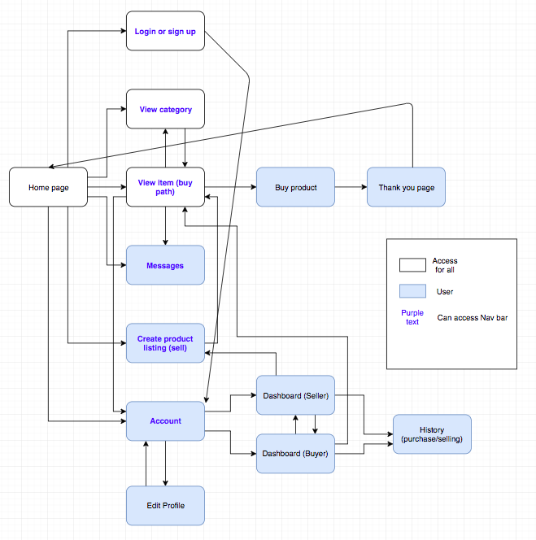

## Style guide
The design guidelines when building Exelim were to enable an effective, efficient, and enjoyable experience when buying, selling, or browsing for second hand PC parts.

For example, when building our website, we wanted to make sure every page was:
* Clean
* Simple
* Intuitive (for our users; more specifically, people who are well versed with technology and PC parts)
* Enjoyable (for our users; more specifically, everything they need and expect are there)
* Effectiveness and efficiency (to create the optimal solution for this problem)

This set of colours were chosen to convey a neutral, reliable, and quality message.

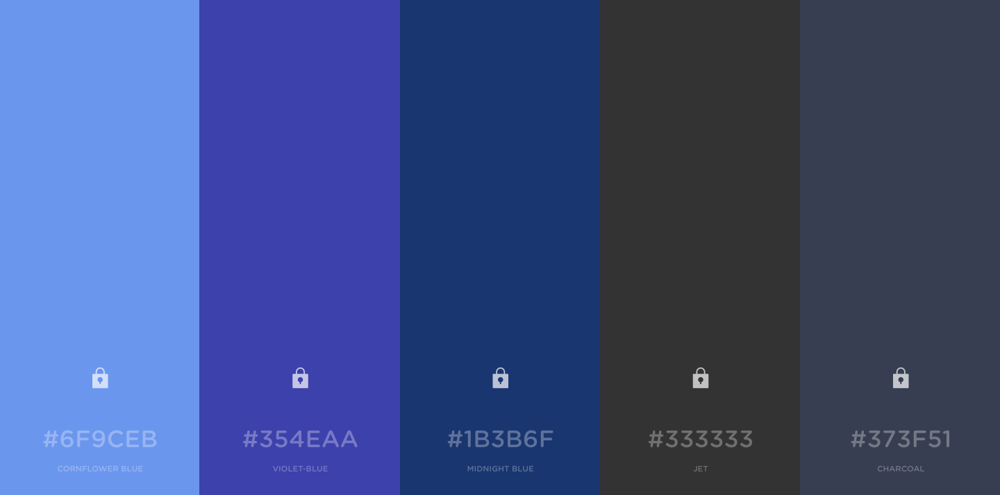

The font style was kept as <a href="https://getbootstrap.com/docs/4.0/content/reboot/">Bootstrap's defaut</a>. The reason being is that the fonts used are aesthetic, simple, and clean. These are attributes that Exelim wants to convey, so I decided to keep it. I may change it in the future.

## Wireframes
Here are some low-medium wireframes created for important sections on the website. 
### Home page
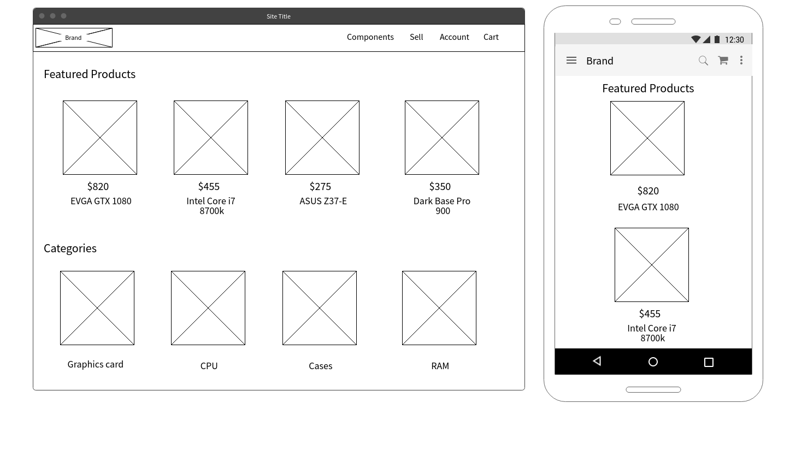

### Listing page
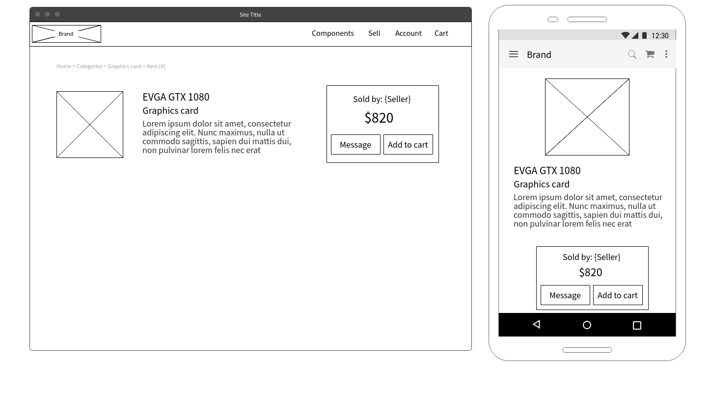

### Sell page
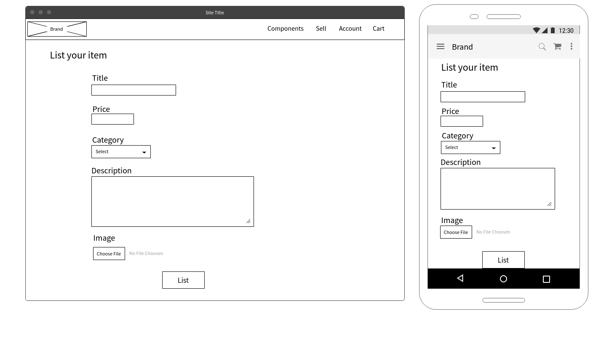

### Sign Up page
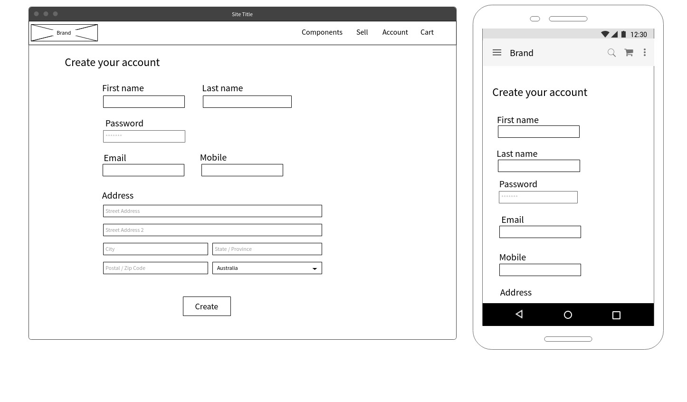

### Profile page
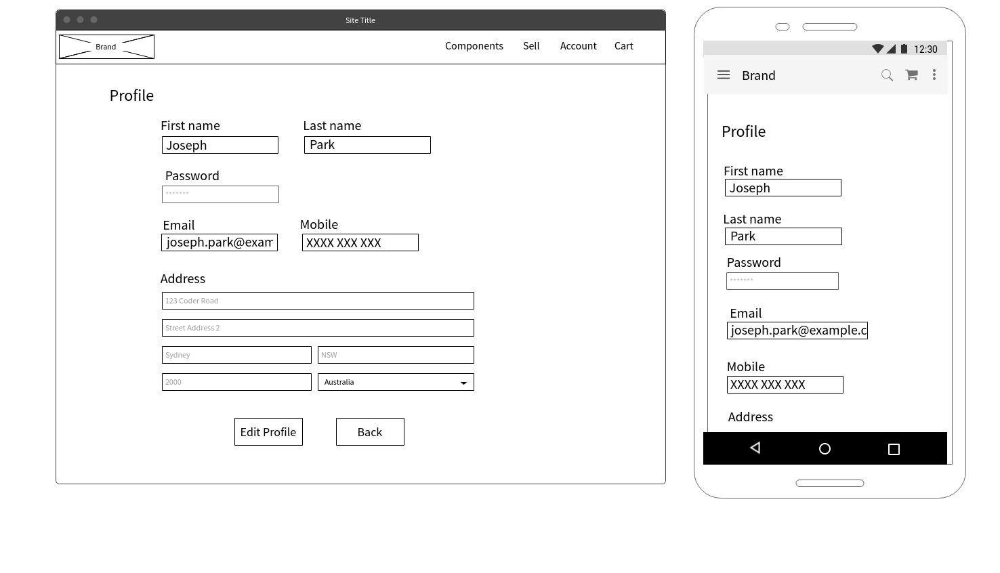

### History page
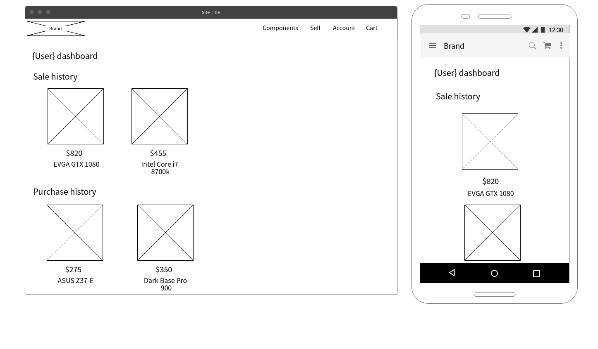

## Updated Wireframes
Here are further iterations on wireframes (note: they are different from how the MVP looks like now).

### Home & Sign Up page
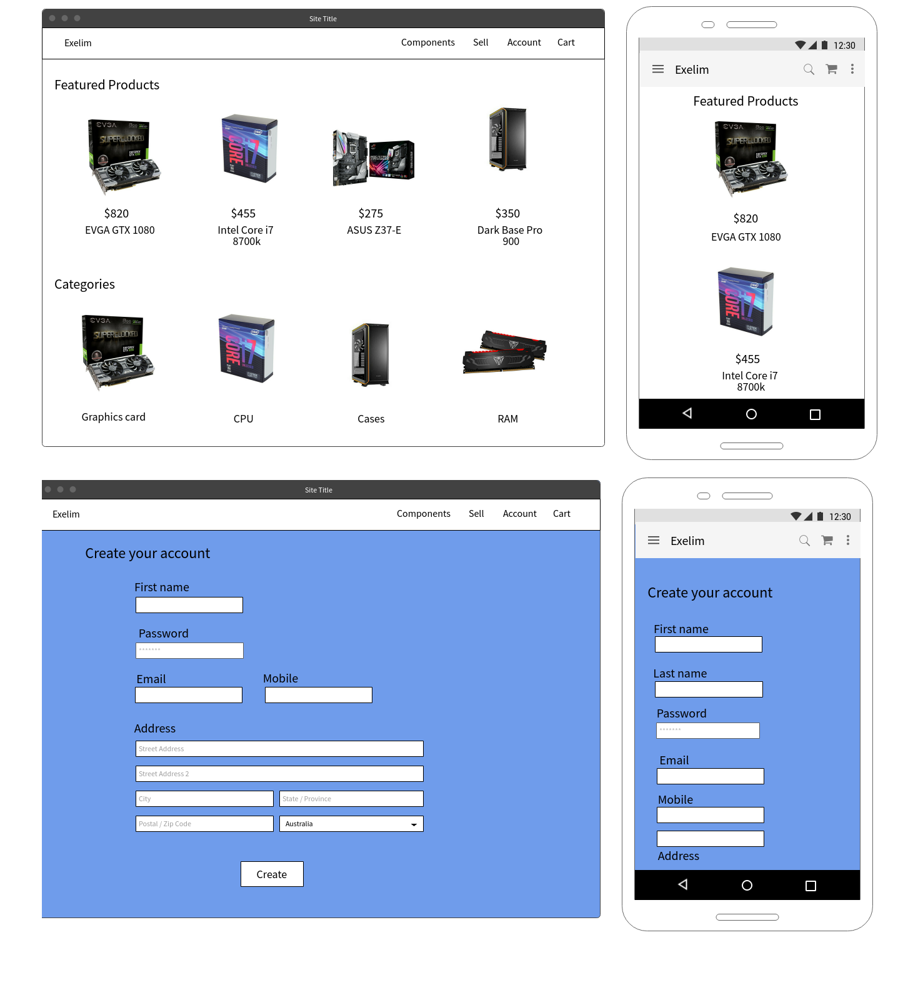

### Listing (show) & Listing (new)

### History
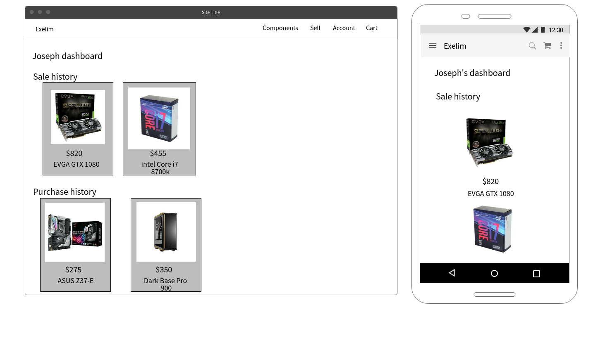

## ERD
The ERD is as follows:
  
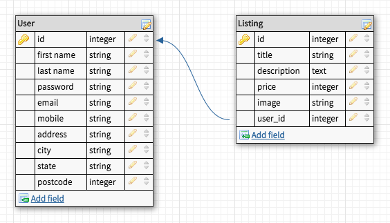

Please note that the user_id is referring to the seller's ID (i.e. not buyer).

## For the future
Next key features to implement:
* Add in the review & rating system
* Search functionality
* User profiles
* Stripe Connect 

Future ideas:
* Sell prebuilt PCs 
* Custom PC building service
* Direct to consumer sale (both second hand parts and new)
* Services related to IT (e.g. support)

## Notes
### Website
* This website cannot take payments
* Reviews and ratings currently are just there for design purposes
* Account dropdown menu is there for design purposes as well

### Tools & Methodologies

#### Trello
Trello was used as my main project management tool. An example screenshot:

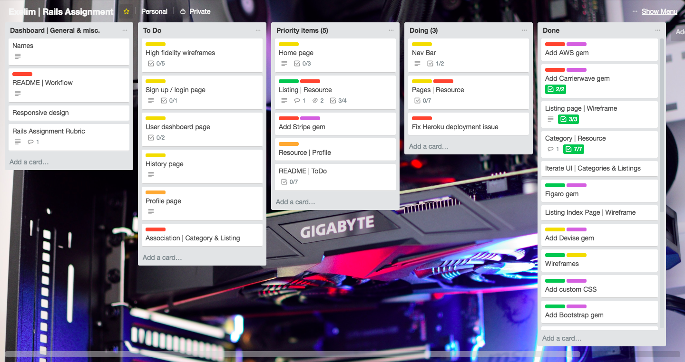

A labelling system was incorporated. For example,
* Green=> All major work completed.
* Yellow => A pending task that has a level of priority and difficulty
* Red => Difficult and/or important task.
* Purple => Gem.
Green = completely done. Yellow = Pending, but not too difficult. Red = Difficult and/or important. Purple = Gem. No label = task.
* No label => A task.

#### Code Reviews
Code reviews were both formally and informally conducted through this project.
* Formally
    * Project milestones and deadlines were reported and discussed with a Teaching Assistant(s). 
    * If a significantly difficult problem was encountered, I would seek assistance from our Teaching Assistants and/or Head Instructor.
* Informally
    * If my peer(s) was stuck on an issue, I would offer assistance. This can be in the form of going through the process with them (if I know it well enough), while reviewing their code. For more difficult endeavours, we would go through the code and documentation together. Similarly, I would have received help if I required it. 
        * E.g. Gems

### 